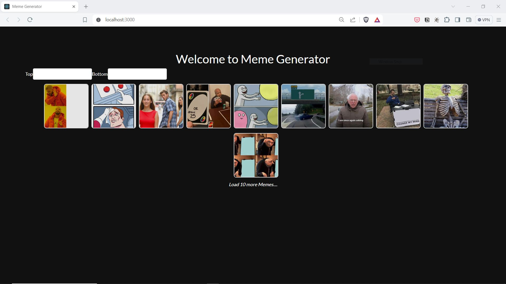
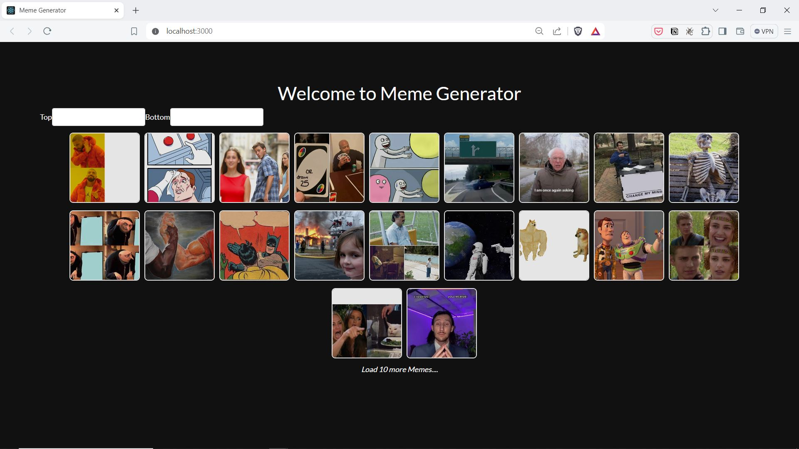
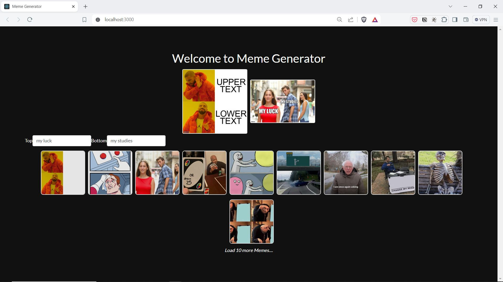

# MemeGenerator
A Simple Meme Generator using react, ImgFlip APIs

## Project setup
```
npm install
```

Note: update credentials in src\actions\secrets.js


# Images

## Landing Page:


## Landing Page - LoadMore Clicked:


## Landing Page - Memes Created

